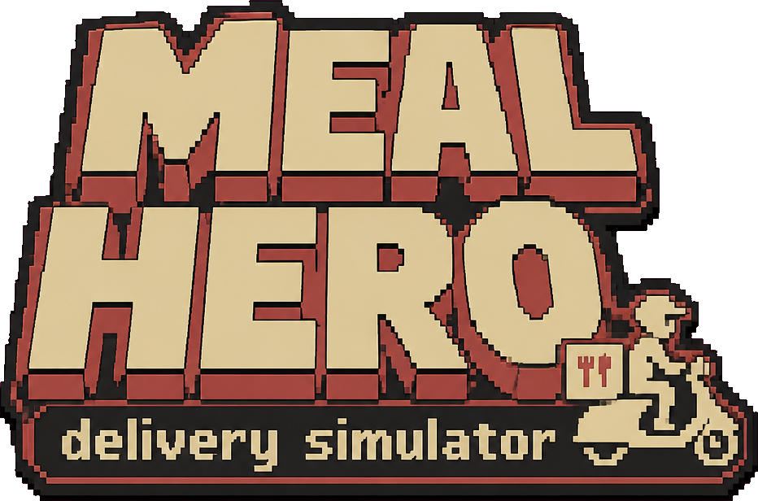
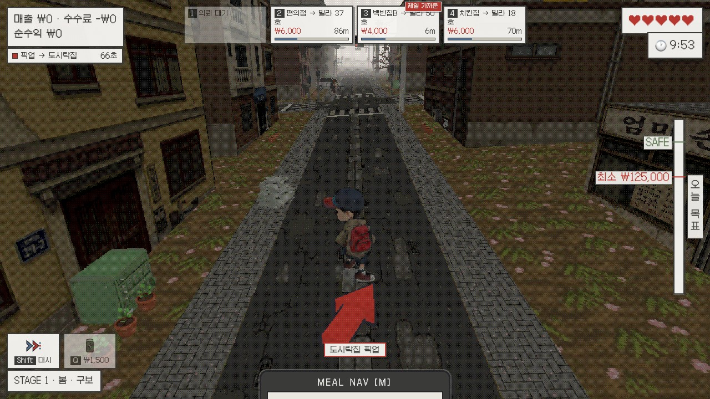

<p align="center">
  
</p>

<p align="center"><b>빚 6,000만 원, 두 다리, 그리고 사계절 — 서울 빌라촌 배달 러너</b></p>

<p align="center">
  <a href="https://interruping.github.io/meal-hero/"><b>▶ 지금 플레이</b></a>
  &nbsp;·&nbsp;
  <a href="https://github.com/interruping/meal-hero/releases/tag/v1.0.0">v1.0.0</a>
  &nbsp;·&nbsp;
  <a href="AI_USAGE.md">AI 활용 기록</a>
</p>

<p align="center">
  
</p>

빚에 쫓기는 주인공이 서울 빌라촌 골목에서 사계절 배달로 빚을 갚아나가는 **PS1 레트로풍 3D 배달 러너**.
NAN 2026 해커톤 사전 과제 제출작 — 코드·3D 모델·텍스처·보이스 전량 AI 제작.

## ▶ 플레이

**https://interruping.github.io/meal-hero/**

설치·로그인 없이 링크 접속만으로 플레이할 수 있습니다. (데스크톱 Chrome 권장, 모바일 미지원)
처음이라면 봄 스테이지의 튜토리얼(약 1분)을, 빠른 체험은 타이틀의 **심사용 메뉴**(계절 직행)를 추천합니다.

### 조작

| 키 | 동작 |
|---|---|
| W A S D | 이동 (카메라 기준) |
| 마우스 | 시점 |
| Space | 점프 |
| 1 ~ 4 | 배달 의뢰 수락 / 수령 영수증 선택 |
| E | 음식 픽업 / 전달 |
| Shift | 대시 — 3초 가속, 쿨타임 10초. 대시 중 방해요소를 받아 날린다 |
| Q | 에너지 드링크 ₩1,500 — 대시 쿨타임 초기화 |
| M (홀드) | 네비게이션 스마트폰 |
| R | 게임오버 시 재시작 |
| ESC | 일시정지 |

### 게임 규칙

- 상단 의뢰 슬롯(10초 안에 사라짐)에서 **1~4**로 수락 — 동시 최대 3건, 배달마다 색깔 마커
- 상가에서 **E**로 픽업 — 3초 안에 내 접수증과 일치하는 주문 영수증을 골라야 한다 (틀리면 −5초)
- 제한 시간 안에 빌라 현관까지 배달 — 단가는 거리·품귀에 따라 변동(₩4,000~8,000), 제한 시간 70% 이내면 +50% 보너스
- 시간 초과는 수수료 −₩3,000. **순수익이 음수가 되면 게임오버**
- 스테이지는 10분 — 종료 시 "10분 순수익 × 120일" 분기 정산으로 **빚 6,000만 원**을 갚는다.
  계절이 바뀌면 더 빠른 탈것(구보 → 킥보드 → 자전거 → 스쿠터), 방해요소도 하나씩 추가
- 방해요소(전단지 알바생·자전거 초딩·비둘기·취객)와 주행 차량, 겨울 눈길을 조심 —
  단, 대시 중엔 무적: 부딪힌 상대가 "쿵!" 하고 날아간다
- 겨울 정산까지 완납하면 해피 엔딩

<p align="center">
  
</p>

## 로컬 실행

```bash
npm install
npm run dev     # http://localhost:5173
npm run build   # dist/ 정적 빌드
```

## 기술

- Three.js + Vite, 물리·충돌 직접 구현 (외부 물리엔진 없음)
- 640×360 저해상도 렌더타깃 → nearest 업스케일 + 포스터라이즈·디더링 (PS1 룩)
- 3D 모델 27종+ (캐릭터·탈것·방해요소·행인 10종·소품): Meshy.ai 생성 + 자동 리깅·애니메이션
- 텍스처 86장 (파사드·지면·계절·간판·이펙트): gpt-image-2 생성 / 한국어 보이스 8클립: gpt-audio-mini 생성
- BGM·효과음: CC0 외부 에셋 (Juhani Junkala, Kenney) + ffmpeg 가공·자체 합성
- 개발 전 과정 Claude Code 에이전트 주도 — 도구·프롬프트·비용 전체 기록은 [`AI_USAGE.md`](AI_USAGE.md)
- 기획·완료 기준: [`PRD.md`](PRD.md) / 외부 에셋 출처: [`CREDITS.md`](CREDITS.md)

## 라이선스

소스 코드는 [MIT License](LICENSE). 외부 에셋(BGM·효과음·폰트)은 각자의 라이선스(CC0, SIL OFL 1.1)를 따르며 출처는 [`CREDITS.md`](CREDITS.md)에 명시.
