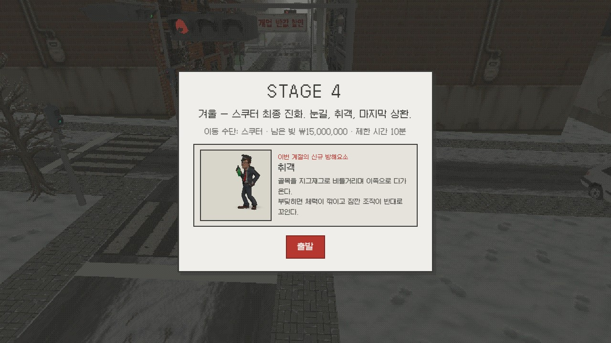
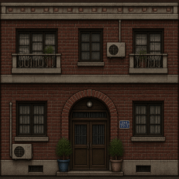
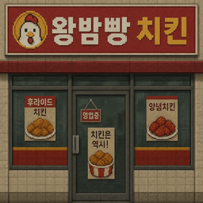
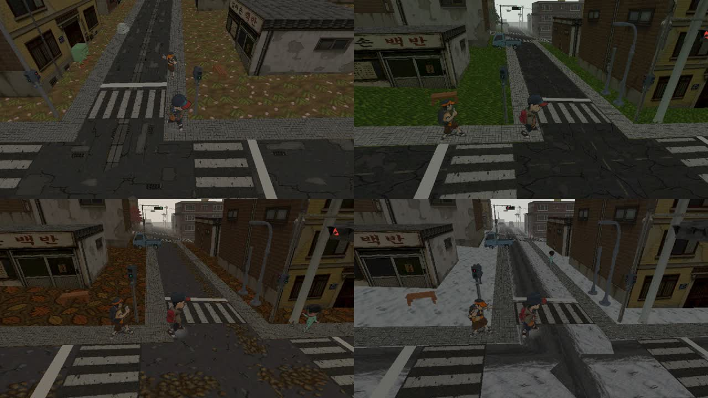

# Meal Hero — AI 활용 기술 문서

> **개발 방식 요약**: 1인 참가. 코드·3D 모델·텍스처·보이스까지 게임의 전 제작 공정을 AI로 수행하되,
> 사람은 **디렉터**로서 요구사항 정의(PRD) → AI 산출물 검수 → 피드백 → 재지시의 루프를 반복했다.
> AI를 "코드 자동완성"이 아니라 **파이프라인을 스스로 작성·실행·검증하는 에이전트**로 운용한 것이
> 이 프로젝트의 핵심이며, 그 과정 전체가 저장소의 커밋 기록과 `AI_USAGE.md`에 남아 있다.

## 1. 전체 구조 — AI 제작 파이프라인

```
[사람: 디렉터]
   │  요구사항·완료 기준 정의 (PRD.md — FR 66건 / AC 71건)
   │  목표 설정 — /goal "PRD 완료 기준 전부 만족할 때까지 개발" (자율 루프 강제)
   │  플레이 검수·피드백 ("빡세다", "박스 티가 난다", "포인터가 사라진다")
   ▼
[Claude Code (에이전트)] ──── 게임 코드 전체 작성 (Three.js + Vite, 약 5,700줄)
   │        │
   │        ├─ 에셋 생성 스크립트를 직접 작성·실행 (scripts/*.mjs)
   │        │     ├─ Meshy.ai API ───── 3D 모델·리깅·애니메이션 (GLB)
   │        │     ├─ gpt-image-2 ───── 텍스처·스프라이트·로고 (PNG)
   │        │     └─ gpt-audio-mini ── 한국어 보이스 SFX (MP3)
   │        │
   │        └─ 후처리 자동화 — 256px 다운스케일, 알파 키잉, ffmpeg 오디오 정리
   │
   └─ 검증 자동화 (Playwright) — 브라우저에서 실제 실행해 완료 기준(AC)을 실측 판정,
      물리 수치(실효 주행 속도 등)를 측정해 밸런싱 근거로 사용
```

- **문서 주도 개발**: `PRD.md`가 단일 기준. 기능마다 요구사항(FR)과 완료 기준(AC)을 먼저 적고,
  AI가 구현 → 브라우저 실측으로 AC 통과를 확인한 뒤 체크. 미확정 사항은 오픈 이슈로 관리
- **기록**: 모든 생성 내역(도구·프롬프트·비용)은 `AI_USAGE.md`에, 커밋은 기능 단위로 분리해
  "과정이 보이는 기록"을 유지 (총 190+ 커밋, feat/fix/art/tune/docs 컨벤션)

## 2. 사용 AI 도구 및 활용 내역

| 도구 | 용도 | 사용량·비용 |
|---|---|---|
| **Claude Code** (Anthropic, Fable 5) | 게임 코드 전체, 에셋 파이프라인 스크립트 작성·실행, 브라우저 검증 자동화, 문서 | 개발 전 과정 |
| **Meshy.ai** (text-to-3d API) | 캐릭터·탈것·방해요소·행인·소품 3D 모델 + 리깅·애니메이션 | 918 크레딧 (한도 1,100) |
| **gpt-image-2** (OpenRouter API) | 텍스처 전반 — 건물 파사드, 지면·도로, 계절 배리에이션, 간판, 이펙트 스프라이트, 로고 | 86장 ≈ **$0.52** |
| **gpt-audio-mini** (OpenRouter API) | 한국어 캐릭터 보이스 8클립 (방해요소 4 + 피드백 4) | ≈ **$0.006** |

이미지·오디오 API 총 지출 **$0.53** (한도 $20의 2.6%), Meshy 크레딧 83% 사용 — 절제된 예산 운용 자체가 디렉팅 결과물이다 (§5 참조).

### 2.1 Claude Code — 코드·파이프라인·검증

- **게임 코드 전체**(Three.js 씬·절차적 도시 생성·차량/신호 AI·배달 경제·UI·오디오 시스템)를 에이전트가 작성.
  사람은 코드를 직접 수정하지 않고 플레이 피드백만 전달
- **Goal 기능으로 완료 기준 주도 자율 루프 구성**: Claude Code의 `/goal` 기능에
  **"PRD.md 완료 기준 전부 만족할 때까지 개발한다"**를 목표 조건으로 걸어 두면,
  에이전트가 작업을 마치려 할 때마다 시스템이 PRD의 체크리스트(FR 66건·AC 71건·오픈 이슈)와
  대조해 미완료 항목이 남아 있으면 종료를 차단하고 다음 작업을 이어가게 한다
  - 효과: 기능을 하나하나 지시하지 않아도 에이전트가 **완료 기준 문서를 스스로 소진**할 때까지
    구현 → 검증 → 문서 체크를 반복 — "문서 주도 개발"이 실제 자율 실행 루프로 작동한 핵심 장치
  - 디렉터의 역할은 목표(완료 기준) 정의와 판단이 필요한 순간의 개입으로 압축된다 —
    예: 밸런싱 최종 판단은 사람 몫으로 명시해 goal 루프에서 제외
- **에셋 파이프라인도 코드로**: Meshy·gpt-image-2 호출, 폴리곤·해상도 제한, 다운로드, 후처리(축소·키잉),
  배치 재시도까지 스크립트(`scripts/meshy-batch.mjs`, `gen-textures.mjs`, `gen-voice.mjs` 등)로 자동화
- **검증 자동화**: Playwright로 게임을 브라우저에서 실제 구동해 완료 기준을 실측
  - 예① 배달 루프: 수락 → 코드 매칭 → 전달 → 정산 금액까지 자동 시나리오로 통과 판정
  - 예② 밸런싱: "겨울이 너무 빡세다"는 플레이 피드백에 대해, 자동 조향 주행으로 **실효 속도를 실측**
    (명목 최고속 대비 가을 0.97 vs 겨울 0.63) → 그 비율을 근거로 겨울 제한 시간 계수 1.5를 산정
  - 예③ 스크린샷 실측: 탑승 정렬·UI 겹침·픽토그램 정렬 등 시각 문제를 스크린샷 좌표 분석으로 보정

### 2.2 Meshy.ai — 3D 모델 (형태가 중요한 고유 에셋 전용)



- 생성물: 주인공, 탈것 3종(킥보드·자전거·스쿠터), 방해요소 4종(전단지 알바생·자전거 초딩·비둘기·취객),
  행인 10종, 주차 차량 2종, 소품 15종, 신호등 헤드 2종 — 이후 **자동 리깅 + 애니메이션 라이브러리**로
  달리기·대기·비틀걸음·앉기 등 스켈레톤 애니메이션 부여
- 공통 스타일 프롬프트로 톤앤매너 통일:

```
chunky cute proportions, low poly, PS1 retro game style, muted desaturated colors
```

- 개별 프롬프트 예시 (전체는 저장소 `AI_USAGE.md`·`scripts/meshy-batch.mjs`):
  - 주인공: `cartoon Korean delivery rider, baseball cap, windbreaker, ...`
  - 취객: `drunk office worker, rumpled suit, swaying, ...`
  - 행인(가분수 보정): `oversized big head taking one third of total height, short stubby legs, ...`
- 다운로드한 GLB는 gltf-transform으로 **텍스처 256px 축소** — PS1 룩과 웹 로딩(27MB → 1.85MB)을 동시에 해결

### 2.3 gpt-image-2 — 텍스처 (로우폴리 + 텍스처 조합 전략)




- **건물을 3D로 뽑지 않는다**: 건물 20종+는 로우폴리 박스에 gpt-image-2 파사드 텍스처를 입히는 방식 —
  PS1 미감에 맞고, Meshy 크레딧을 캐릭터에 집중시키는 비용 전략. 창문·간판·벽돌은 텍스처에 그려진다
- 생성물 86장: 빌라 파사드 14, 상가 전면 12(한글 간판), 계절별 지면·도로·나무·보도블럭 16,
  소품·공용 재질 29, 이펙트 스프라이트 3, 신호 텍스처 3, 타이틀 로고 1 등
- **전량 low 품질($0.006/장)** — 어차피 256px로 다운스케일 + nearest 필터를 적용하는 PS1 룩이라
  고품질 생성이 불필요하다는 판단. 실패 재생성 포함 총 $0.52
- 후처리 자동화: 1024px 원본 → 256px 다운스케일, 빌보드류(나무·고양이·빨래)는 배경 알파 키잉.
  로고는 마젠타 배경 생성 후 채널 부호 규칙(r−g>50 ∧ b−g>30)으로 키잉
- 이펙트 스프라이트 기법: 대시 넉백 "쿵" 스타버스트는 **검정 배경으로 생성 → additive 블렌딩 합성** —
  알파 추출 공정 자체를 생략하고 발광 효과까지 얻음




- 대표 프롬프트 (임팩트 스프라이트):

```
Comic book impact starburst sprite for a retro PS1 game. Jagged cartoon explosion
flash star shape, warm golden yellow center fading to orange, dark brown-red jagged
outline, chunky low-res pixel art look, muted low-saturation retro palette, single
centered sprite filling most of frame, plain solid black background, no text
```

### 2.4 gpt-audio-mini — 한국어 캐릭터 보이스

- 방해요소 보이스 4종("전단지 받아가세요~!", "따르릉 따르릉! 비켜주세요!!" 등) +
  피드백 보이스 4종(코드 매칭 정답·오답 사장님, 전달 기사·손님) — 캐릭터별 목소리(voice)와
  system 프롬프트 연기 지시로 톤 차별화
- 기술 요점: chat completions에 `modalities:["text","audio"]` + `stream:true` + `pcm16`으로 호출,
  SSE 조각을 조립해 ffmpeg로 mp3 변환
- 시행착오: 초기 산출물이 대사를 6~9초로 늘여 읽음 → system에 "빠르고 경쾌하게 딱 한 번, 늘여 읽기 금지"
  지시 추가 + ffmpeg 무음 트림·1.25배속 후처리로 1~3.7초에 안착
- BGM·비음성 효과음은 음성 모델로 만들 수 없어 CC0 외부 에셋 사용 (§6에 전체 출처)

## 3. 대표 지시(프롬프트) 사례 — 디렉터 → 에이전트

코드 생성형 지시는 자연어 요구사항으로 전달하고, 에이전트가 설계·구현·검증까지 수행했다. 실제 사례:

| 디렉터 지시 (요약) | 에이전트 수행 |
|---|---|
| "스테이지 4 배달 시간이 너무 촉박한지 재검토해줘" | 겨울/가을 자동 주행 실측 → 실효 속도 비율 산출 → 계수 1.5 적용 → 4스테이지 회귀 검증 |
| "대시 중 충돌하면 방해요소가 받쳐 날아가게 + 쿵! 이펙트" | 4종 넉백 물리(포물선·회전·기절 복귀), 차량 넉백, 임팩트 스프라이트 생성·합성, SFX 조달, AC 실측 |
| "픽업 중인 식당이 의뢰에 또 나오는 버그" | 원인 분석(추첨 제외 누락) → 수정 → 재노출 0/200회 스트레스 검증 |
| "신호등이 텍스처 씌운 박스 티가 난다" | Meshy로 헤드 2종 재생성(프리뷰 검수 후 refine), 등화는 자발광 오버레이 토글로 구현 |
| "다음 스테이지로 넘어갈 때 일시정지가 뜬다" | 포인터록 상태 잔존 원인 규명 → 수정 → 락 시나리오 재현 검증 |

## 4. 시행착오와 해결 (기록 발췌)

- **Meshy 리깅 부작용**: 주인공 등에 구워진 가방이 손 본에 바인딩되어 달리기 때 등판이 펄럭임 —
  지오메트리 수정 + 해당 정점을 척추 본으로 리스킨하는 후처리로 해결 (재생성 대신 후처리 우선 원칙)
- **비율 불일치**: 행인 재생성(프롬프트 도박)으로 235크레딧을 소모하고도 품질 혼재 → 폐기하고,
  **머리 본 런타임 스케일**(추가 비용 0)로 주인공과 가분수 비율을 정합 — "재생성보다 후처리"를 원칙화한 계기
- **얇은 구조물 생성 실패**: 난간이 파이프 덩어리로 생성 → 프롬프트에 `all aligned in one single
  flat vertical plane` 평면 제약을 명시해 해결. 이후 refine 전 프리뷰 썸네일 검수를 표준 절차화
- **텍스처 베이크 결함**: 행인 몸통에 얼굴이 투영 → 브라우저 레이캐스트로 결함 부위 UV 삼각형을 수집해
  해당 텍셀만 리페인트 (정상 디테일 보존)

## 5. 비용 가드레일 — 디렉팅 원칙

- **품질 하한 고정**: gpt-image-2는 low 품질만 사용 (PS1 다운스케일 전제라 충분) — high 금지 규칙 명문화
- **배치 계획 후 생성**: 필요 목록을 먼저 정리하고 일괄 생성 — 같은 에셋 반복 재생성 낭비 금지
- **프리뷰 검수 후 확정**: Meshy는 preview(5cr) 썸네일 검수 후에만 refine(10cr) 진행
- **러닝 토탈 기록**: 생성 즉시 `AI_USAGE.md`에 도구·프롬프트·비용 기록, 누적액 상시 추적
- 결과: 이미지+오디오 **$0.53 / $20 한도**, Meshy **918 / 1,100 크레딧**으로 전체 에셋 완성

## 6. 외부 에셋 / 오픈소스 출처

AI 생성물 외에 사용한 외부 자원 전체 (저장소 `CREDITS.md`와 동일):

| 자원 | 출처 | 라이선스 | 용도 |
|---|---|---|---|
| Three.js | https://threejs.org/ | MIT | 3D 렌더링 |
| Vite (Rolldown) | https://vite.dev/ | MIT | 빌드·개발 서버 |
| BGM 5곡 | Juhani Junkala — OpenGameArt [5 Chiptunes (Action)](https://opengameart.org/content/5-chiptunes-action) / [4 Chiptunes (Adventure)](https://opengameart.org/content/4-chiptunes-adventure) | CC0 | 메뉴·계절 BGM (ffmpeg mp3 변환) |
| 효과음 13종 | [Kenney](https://kenney.nl/) — Interface Sounds / Casino Audio / Impact Sounds | CC0 | 돈소리·충돌·UI·타격 등 (일부 ffmpeg 합성·가공) |
| Galmuri11 폰트 | https://github.com/quiple/galmuri | SIL OFL 1.1 | 한글 픽셀 UI 폰트 |

- 예외: 니어미스 경적(`sfx-horn.mp3`)은 외부 에셋이 아니라 **ffmpeg 사인파 합성으로 자체 제작**
  (420+505Hz 화음 + 배음 — Kenney 팩에 경적이 없어 직접 합성)
- 위 외부 에셋을 제외한 **모든 시각·음성 에셋과 소스 코드는 본 프로젝트에서 AI로 생성**했다

## 7. 상세 기록 위치

- **생성 전량의 도구·프롬프트·비용 원장**: 저장소 [`AI_USAGE.md`](https://github.com/interruping/meal-hero/blob/main/AI_USAGE.md)
- **요구사항·완료 기준·의사결정 기록**: 저장소 [`PRD.md`](https://github.com/interruping/meal-hero/blob/main/PRD.md)
- **커밋 히스토리** (기능 단위, 과정 추적 가능): https://github.com/interruping/meal-hero/commits/main
