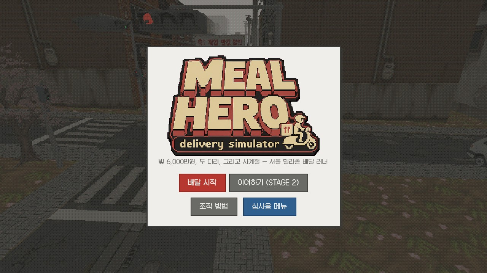
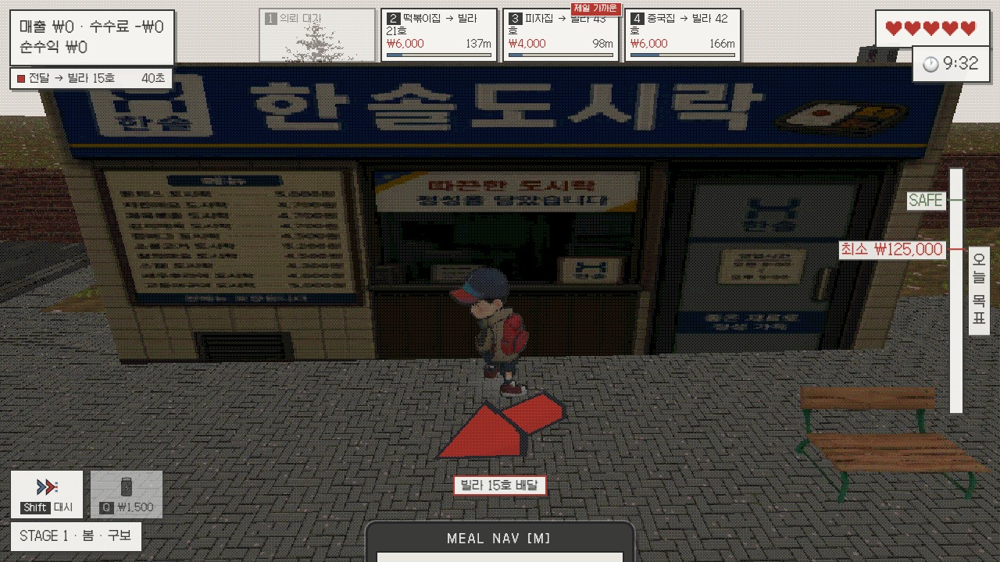
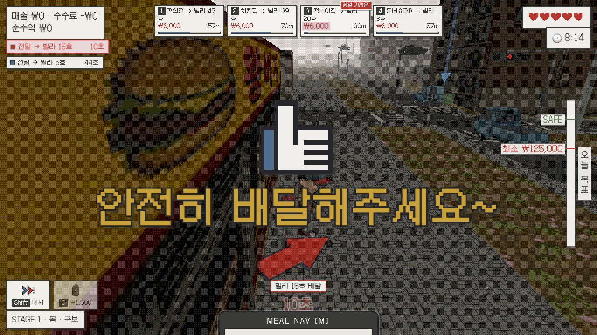
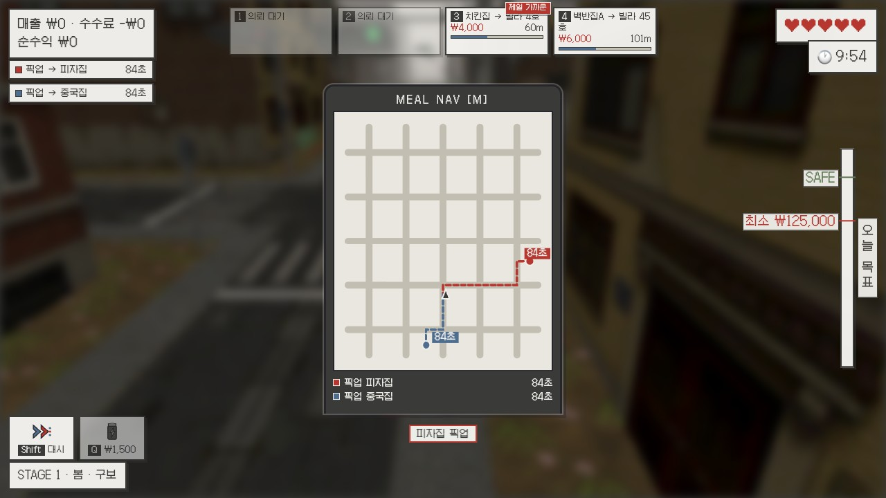
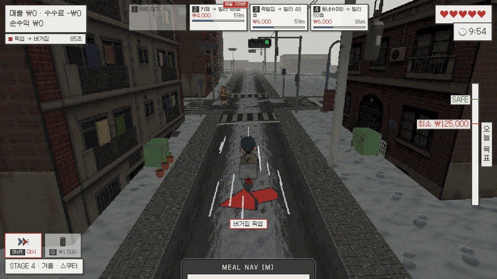
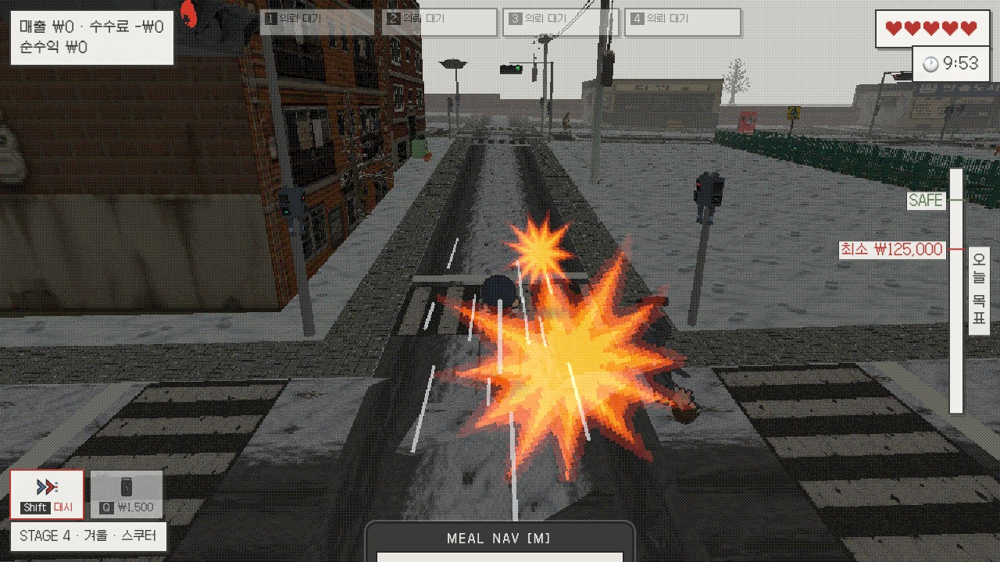
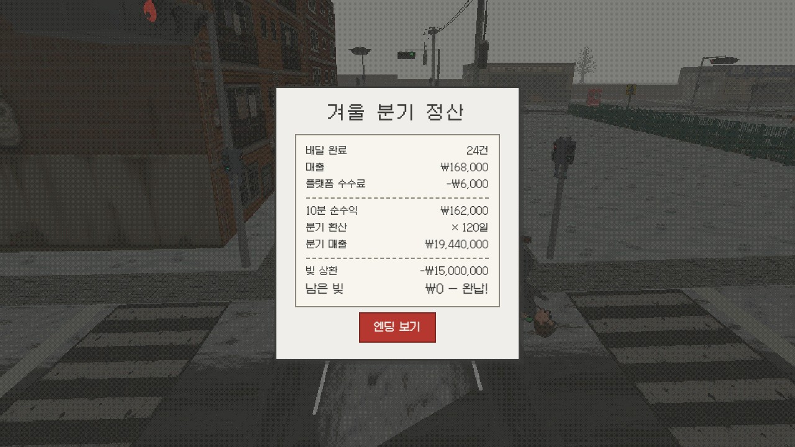

# Meal Hero — 게임 소개 및 설명 문서



## 1. 게임 제목 및 한 줄 소개

**Meal Hero (밀 히어로) : delivery simulator**

> 빚 6,000만 원, 두 다리, 그리고 사계절 — 서울 빌라촌 골목을 달리는 배달 라이더가
> 봄·여름·가을·겨울 네 분기 동안 배달로 빚을 전부 갚아내는 PS1 레트로풍 3D 아케이드 게임.

- **장르**: 3D 아케이드 배달 시뮬레이션 (싱글 플레이)
- **플랫폼**: 웹 브라우저 (데스크톱 권장, 설치 불필요)
- **분량**: 스테이지당 10분 × 4계절 — 1회차 약 40분, 심사용 계절 직행 메뉴 제공
- **아트 디렉션**: PS1 레트로 로우파이 — 로우폴리 + 저해상도 픽셀 텍스처 + 저채도 팔레트, 포스터라이즈·디더링 후처리

## 2. 게임 개요

주인공은 개업 실패로 빚 6,000만 원을 진 청년. 서울의 언덕진 빌라촌에서 배달 대행을 뛰며
한 계절(분기)에 한 번씩 빚을 상환한다. 계절이 지날 때마다 이동 수단이 진화하고
(구보 → 킥보드 → 자전거 → 스쿠터), 골목의 방해요소는 하나씩 늘어난다
(전단지 알바생 → 자전거 초딩 → 비둘기 떼 → 취객). 겨울에는 눈길에 스쿠터가 미끄러진다.

10분의 스테이지 동안 벌어들인 순수익은 "하루 매출 × 120일"로 분기 정산되어 빚을 깎는다.
겨울 정산까지 완납하면 해피 엔딩, 남으면 배드 엔딩 후 겨울 재도전.


### 핵심 특징

- **계절 진행**: 지면·도로·가로수·하늘 팔레트가 계절마다 교체되고 방해요소·탈것·BGM이 함께 바뀐다
- **경제 압박 루프**: 동적 단가(거리·품귀 웃돈) / 스피드 보너스 +50% / 지각 수수료 −₩3,000 / 순수익이 음수가 되는 순간 게임오버
- **수령 코드 매칭**: 픽업 시 3초 안에 영수증 4장 중 내 주문 코드를 골라야 하는 미니게임 — 정답·오답에 대형 타이포 연출
- **살아있는 골목**: 신호등을 지키는 행인 10종, 신호에 급정거하는 주행 차량, 니어미스 경적, 대시로 방해요소를 받아 날리는 넉백 연출

## 3. 게임 방법

### 3.1 목표

- 각 스테이지(계절)는 **10분 제한**. 배달을 완수해 순수익(매출 − 수수료)을 쌓는다
- 스테이지 종료 시 **분기 정산**: 순수익 × 120일만큼 빚 상환
- **최종 목표: 겨울 정산까지 빚 6,000만 원 완납** (화면 우측 "오늘 목표" 게이지가 하루 최소 목표와 SAFE선을 안내)

### 3.2 기본 루프


1. **의뢰 수락** — 화면 상단 의뢰 슬롯 4칸에 랜덤 노출 (10초 내 미수락 시 소멸). `1~4` 키로 수락, 동시 3건까지
2. **픽업** — 3D 화살표·네비게이션을 따라 식당으로 이동, `E` 키로 픽업
3. **수령 코드 매칭** — 내 주문 코드와 같은 영수증을 3초 안에 `1~4`로 선택. 오답·시간 초과는 배달 시간 −5초
4. **전달** — 목적지 빌라 현관에서 `E`. 제한 시간 70% 이내 도달 시 **스피드 보너스 +50%**
5. 시간 초과 시 지각 수수료 −₩3,000 — **순수익이 음수가 되면 그 자리에서 게임오버**





### 3.3 조작

| 키 | 동작 |
|---|---|
| `W` `A` `S` `D` | 이동 |
| 마우스 | 시점 조작 |
| `Space` | 점프 |
| `1` ~ `4` | 의뢰 수락 / 수령 영수증 선택 |
| `E` | 픽업 / 전달 |
| `Shift` | 대시 — 3초간 2.25배 가속, 쿨타임 10초 |
| `Q` | 에너지 드링크 ₩1,500 — 대시 쿨타임 즉시 초기화 |
| `M` (홀드) | 네비게이션 스마트폰 — 진행 배달별 최단 경로·남은 시간 |
| `R` | 재시작 (게임오버 화면) |
| `ESC` | 일시정지 |



### 3.4 방해요소와 위험

| 요소 | 등장 | 효과 |
|---|---|---|
| 전단지 알바생 | 봄~ | 쫓아와 전단지 투척 — 맞으면 감속·밀려남. 한 번 맞히면 10초간 휴전 |
| 자전거 초딩 | 여름~ | 골목 고속 직진 — 부딪히면 넘어짐 (체력·배달 시간 손실) |
| 비둘기 떼 | 가을~ | 접근 시 화면으로 날아올라 시야 방해 |
| 취객 | 겨울 | 지그재그로 다가옴 — 부딪히면 잠깐 조작 반전 |
| 주행 차량 | 상시 | 스쿠터 3배속 질주 — 치이면 체력 ¼. 신호등 앞에서만 정지 |
| 눈길 (겨울) | 겨울 | 노면이 미끄러워 가감속·코너링이 크게 둔해짐 |

**대시 중에는 방해요소의 효과를 무시하고, 부딪힌 대상(주행 차량 포함)을 "쿵!" 임팩트와 함께 받아 날린다** — 위험을 정면 돌파하는 하이리스크 하이리턴 수단.





### 3.5 종료 조건

| 조건 | 결과 |
|---|---|
| 겨울 정산까지 빚 완납 | **해피 엔딩** |
| 체력(하트 5) 소진 | 게임오버 — `R` 재도전 |
| 순수익 음수 (수수료 > 매출) | 게임오버 — `R` 재도전 |
| 겨울 정산 후 빚 잔여 | 배드 엔딩 — 겨울 재도전 가능 |



## 4. 실행 방법

### 4.1 웹에서 바로 플레이 (권장)

- **플레이 링크: https://interruping.github.io/meal-hero/**
- 링크 접속 → "배달 시작" 클릭. 설치·로그인 불필요, 데스크톱 Chrome/Edge/Safari 권장
- 처음이라면 봄 스테이지 시작 시 제안되는 **튜토리얼(약 1분)** 추천

### 4.2 심사용 메뉴

- 타이틀 화면 파란색 **[심사용 메뉴]** 버튼 → 봄·여름·가을·겨울 원하는 계절 바로 시작
- 계절 직행 시 앞 계절들을 정상 진행한 것으로 간주해 빚·목표가 자동 보정된다 (계절당 1,500만 원 상환 가정)


### 4.3 로컬 실행 (소스 코드)

- **저장소: https://github.com/interruping/meal-hero** (커밋 기록 전체 공개)

```bash
git clone https://github.com/interruping/meal-hero.git
cd meal-hero
npm install
npm run dev   # http://localhost:5173
```

- 정적 빌드: `npm run build` → `dist/` (GitHub Pages 배포와 동일)
- 요구 사항: Node.js 20+, 별도 유료 라이선스·API 키 불필요 (게임 실행에는 외부 API를 쓰지 않는다)

## 5. 플레이 영상

- **YouTube: [영상 링크 — 업로드 후 기입]**

## 6. 문서·크레딧

- 기획·요구사항·완료 기준: 저장소 `PRD.md` (요구사항 66건 / 완료 기준 71건 전 항목 통과 기록)
- AI 활용 내역: 제출물 「AI 활용 기술 문서」 및 저장소 `AI_USAGE.md`
- 외부 에셋·라이선스: 저장소 `CREDITS.md`
